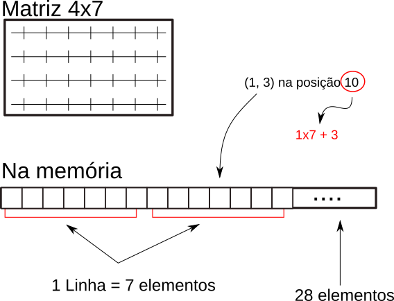

# 04 - Medição de desempenho

Apesar de podermos medir o tempo que nosso programa demora usando o comando `time`, não conseguimos nenhuma informação importante de qual parte do programa está consumindo mais tempo. Este processo de dissecar um programa e entender exatamente qual parte demora quanto é chamada de **Profiling**. 

!!! warning "Software"
    Para esta aula precisaremos dos seguintes pacotes instalados. 

    * `valgrind` - ferramenta de análise de código executável
    * `kcachegrind` - visualizador de resultados do `valgrind`


## Preparação

É preciso compilar um executável com profiling habilitado para medir os tempos. 

```
g++ -g euclides-ingenuo.cpp -o euclides-ingenuo
```

Após este passo, devemos executar o programa usando o `valgrind` com as opções abaixo.


```
valgrind --tool=callgrind ./seu_exec < entrada > saida
```

Para mostrar os resultados usando o `kcachegrind` usamos o seguinte comando. 

```
kcachegrind callgrind.out.(pid aqui)
```

## Medindo os tempos no seu próprio programa

Na demonstração pudemos ver que grande parte do tempo do programa da Tarefa 1 é gasto mostrando a saída no terminal. Isto nos leva à primeira conclusão da atividade de hoje:

!!! info "Entrada e saída de dados são operações muito lentas"


!!! example 
    Faça o teste da demonstração em seu próprio programa e anote abaixo, para as duas versões de `calcula_distancias`,

    1. o tempo relativo de execução 
    1. o número absoluto de instruções executadas

!!! question
    O número absoluto de intruções executadas diminuiu significativamente depois de nossa otimização? Teoricamente só calculamos metade da matriz, esse número é quase metade da versão não otimizada? Você consegue dizer por que?

    ??? details "Resposta"
        Deve ter havido uma diminuição, mas não chega nem perto de metade. Isso ocorre por várias razões:
        
        1. nosso `for` duplo continua percorrendo a matriz inteira, apesar de só fazer o cálculo em metade das posições. 
        2. alocamos a matriz elemento a elemento enquanto fazemos os cálculos.

Com isso em mente, vamos agora otimizar a função `calcula_distancias`. Já sabemos que o efeito no tempo final não será grande. Nosso objetivo então será verificar a seguinte afirmação. 

!!! info "Dois algoritmos de mesma complexidade computacional podem ter tempos de execução muito diferentes"

!!! question
    A resposta da questão anterior indica que só usar um `if` para evitar o cálculo repetido não é suficiente. Precisamos efetivamente fazer um `for` que percorre só metade da matriz. Supondo que a matriz já esteja inteira alocada, escreva em pseudo-código como fazê-lo.

    ??? note "Resposta"
        ```
        para i=1..N:
            para j=i..N:
                DX = X[i] - X[j]
                DY = Y[i] - Y[j]
                DIST = sqrt(DX*DX + DY*DY)
                D[i,j] = DIST
                D[j,i] = DIST
        ```


## Matrizes (versão 2)

Nossa implementação usando `vector<vector<double>>` tem um problema sério: ela aloca elemento a elemento uma estrutura grande que já sabemos o tamanho de início. Seria muito melhor se pudéssemos alocar todas as $N^2$ posições da matriz de  uma só vez!

Fazemos isso trabalhando com um layout de memória contínuo. Ou seja, armazenaremos a matriz linha a linha como um único vetor de tamanho `n*n`. Temos várias vantagens:

1. tempo de alocação de memória é reduzido, já que só fazemos uma chamada
1. podemos acessar qualquer posição a qualquer momento
1. melhor desempenho de cache

A figura abaixo exemplifica esse layout de memória:



!!! question
    Em uma matriz de tamanho `4x7` (4 linhas, 7 colunas), qual é o elemento do vetor que representa a posição `2x5` (linha 3, coluna 6)?

    ??? details
        Estamos considerando que começamos a contar as linhas e colunas do zero. A posição do vetor é `19`. Este número é obtido pela expressão

        `i * c + j`

        * `i` é a linha a ser acessada
        * `j` é a coluna
        * `c` é o número de colunas da matriz

        `19 = 2 * 7 + 5`

!!! tip
    Conseguimos redimensionar um vetor usando o método `resize`, que recebe o novo número de elementos do vetor. 

!!! example
    Faça uma terceira versão de `calcula_distancias`, desta vez usando o layout de memória acima. Verifique que o programa continua retornando os mesmos resultados que as versões anteriores. 

!!! question
    Rode novamente os testes de profiling e verifique o número de instruções para esta nova versão. Compare este valor com os anteriores e comente. 
